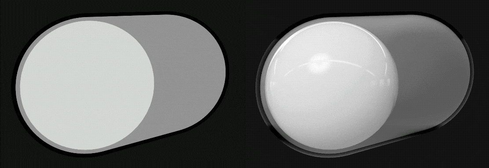
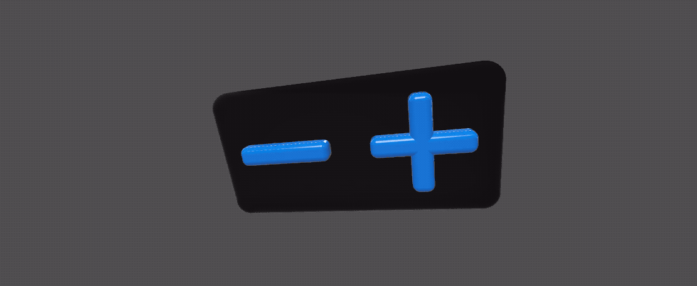
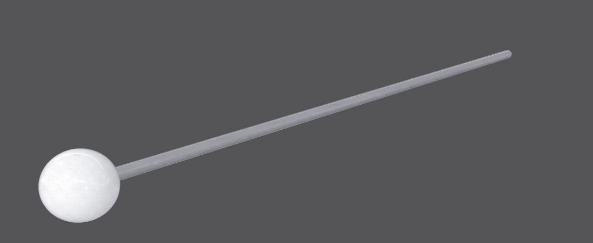

# RealityUI

RealityUI is a collection of User Interface classes for RealityKit.
The classes included in RealityUI aim to offer familiar User Interface guidelines, but in a 3D setting for Augmented and Virtual Reality through RealityKit.


## Requirements

- iOS 13 (or macos 10.15 without drag gestures)
- Swift 5.2
- Xcode 11

## Content

- [Installation](#installation)
- [Usage](#usage)
- [RUIEntities](#creating-realityui-entities)
  - [RUISwitch](#ruiswitch-creation)
  - [RUIStepper](#ruistepper-creation)
  - [RUISlider](#ruislider-creation)
- [RealityUI Components](#realityui-components)
  - [RUIComponent](#ruicomponent)
  - [SwitchComponent](#switchcomponent)
  - [StepperComponent](#steppercomponent)
  - [SliderComponent](#slidercomponent)

## Installation

### Swift Package Manager

Add the URL of this repository to your Xcode 11+ Project under `Swift Packages`.

`https://github.com/maxxfrazer/RealityUI.git`

## Usage

Add `import RealityUI` to the top of your swift file to start.

#### Registering RealityUI Components

All components used in RealityUI must be registered before they are used, simply call `RealityUI.registerComponents()` anywhere in your app before any classes starting with `RUI` are initialised to avoid issues with that. For more information on what is meant by registering components [see Apple's documentation here](https://developer.apple.com/documentation/realitykit/component/3243766-registercomponent).

#### Activating Gestures

If you plan on using RUISwitch or RUIStepper, then you should at least enable `.tap`
RUISlider uses `.pan`, but I would just recommend using `.all` to avoid issues, as these will inevitably move around ad RealityUI develops, and will not interfere with the rest of your RealityKit scene.

`arView.enableRealityUIGestures(.all)`

### Creating RealityUI Entities

For the sake of all these examples, the _Simple_ heading will create an Entity with no custom properties or callbacks, and for _Functional_, imagine there is a `ModelEntity` in the scene which we can reference from the variable `adjustmentCuboid`.

By default all RealityUI Entities are quite large. This is used to standardize the sizes so that you always know what to expect. For example, all UI thumbs are spheres with a diameter of 1 meter, which is 1 unit in RealityKit.

#### RUISwitch Creation

RUISwitch is a 3D toggle switch with an on and off state.


Default bounding box is 2x1x1m

##### Simple

```swift
let newSwitch = RUISwitch()
```

##### Functional

This RUISwitch will respond to lighting, and will change a ModelEntity's material between a red and a green color.

```swift
let newSwitch = RUISwitch(
  RUI: RUIComponent(respondsToLighting: true),
  changedCallback: { mySwitch in
    adjustmentCuboid.model?.materials = [
      SimpleMaterial(
        color: rSwitch.isOn ? .green : .red,
        isMetallic: false
      )
    ]
  }
))
```

#### RUIStepper Creation

RUIStepper is used to increment or decrement a value.


Default bounding box is 2x1x0.25m

##### Simple

```swift
let newStepper = RUIStepper()
```

##### Functional

This RUIStepper will move a ModelEntity's y position up and down by 0.1m on each tap.

```swift
let stepper = RUIStepper(upTrigger: { _ in
  adjustmentCuboid.position.y += 0.1
}, downTrigger: { _ in
  adjustmentCuboid.position.y -= 0.1
})
```

#### RUISlider Creation

An interactive track to represent an interpolated value.


Default bounding box is 10x1x1m (Including thumb)

##### Simple

```swift
let newSlider = RUISlider()
```

##### Functional

This RUISlider has a starting value of 0.9, meaning that the thumb will be positioned 90% of the way along. The callback function will happen every time the slider value changes (set with `isContinuous`). The callback function will adjust the x scale of an Entity to the slider's value (0-1), plus an arbitrary value of 0.1.

```swift
let newSlider = RUISlider(
  slider: SliderComponent(startingValue: 0.9, isContinuous: true)
) { (slider, state) in
  adjustmentCuboid.scale.x = slider.value + 0.1
}
```

## RealityUI Components

These components are largely for customising RealityUI entities in terms of colour and sizing. The components default values are great for most use-cases, but there may be times when more customisation is necessary.

### RUIComponent

| Property           | Type | Default | Description|
|--------------------|------|---------|------------|
| ruiEnabled         | Bool | true    | A Boolean value showing if the entity can be clicked or otherwise affected by gestures.<br><br>Default is `true`, and when set to `false` all the materials change to become translusent.|
| respondsToLighting | Bool | false   | A Boolean value which affects the materials used on this Entity to be affected by light or not. Defautl is `true`.|


### SwitchComponent

SwitchComponent is used for the RUISwitch class, it has properties which affect colour for each model, as well as sizing between components such as the border.

| Property    | Type           | Default      | Description |
|-------------|----------------|--------------|----------------------------------------------------------------------------|
| isOn        | Bool           | false        | A Boolean value that determines the off/on state of the switch. |
| padding     | Float          | 0.05         | Padding (in meters) between the thumb and the inner capsule of the switch. |
| border      | Float          | 0.05         | Border (in meters) between the two outer capsules of the switch. |
| onColor     | Material.Color | .systemGreen | Color of the inner capsule when the switch is set to `on`. |
| offColor    | Material.Color | .lightGray   | Color of the inner capsule when the switch is set to `off`. |
| borderColor | Material.Color | .black       | Color of the outer border. |
| thumbColor  | Material.Color | .white       | Color of the thumb. Default white. |

### StepperComponent

| property | type | Default | Description |
|------------------|-----------------|---------------------------|------------------------------------------------------------------------------------|
| backgroundTint | Material.Color | .tertiarySystemBackground | Background color of the stepper. |
| buttonTint | Material.Color | .systemBlue | Color of the buttons inside a stepper, default `.systemBlue`. |
| secondButtonTint | Material.Color? | nil | Color of the second button inside a stepper.<br>If nil, then buttonTint will be used. |

### SliderComponent

| Property | Type | Default | Description |
|---------------|----------------|-------------|--------------------------------------------------------------------------------------------------------------------------|
| length | Float | 10 | Length of the slider in meters. |
| value | Float | 0 | The slider's current value (0-1). |
| minTrackColor | Material.Color | .systemBlue | The color set to the material on the left side of the slider. |
| maxTrackColor | Material.Color | .systemGray | The color set to the material on the right side of the slider. |
| thumbColor | Material.Color | .white | The color set to the material of the thumb. |
| isContinuous | Bool | true | If set to true, you can receive all changes to the value, otherwise only at the start and end of changes made via touch. |
| thickness | Float | 0.2 | The thickness of the track in meters. |

#### More

To see more, check out [RealityUI+Examples](./RealityUI+Examples) in this repository.
